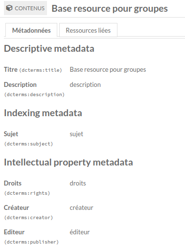

Modèles de ressource avancés (module pour Omeka S)
==================================================

> __Les nouvelles versions de ce modules et l’assistance pour Omeka S version 3.0
> et supérieur sont disponibles sur [GitLab], qui semble mieux respecter les
> utilisateurs et la vie privée que le précédent entrepôt.__

See [English readme].

[Advanced Resource Template] est un module pour [Omeka S] qui ajoute de
nouvelles options aux modèles de ressources afin de faciliter et d’améliorer
l’édition des ressources :

- Obligation de choisir une classe parmi une liste définie :

  )

- Limitation du formulaire à la liste de propriétés définie :

  

- Longueur minimale/maximale pour une valeur textuelle ;

- Nombre minimum et maximum de valeurs :

  Cette option permet de n’avoir qu’une seule valeur, par exemple une catégorie
  principale ou une date de publication, ou de limiter le nombre de valeurs à un
  nombre spécifique.

- Valeur par défaut :

  Cette option rend plus simple la création manuelle des ressouces.

- Valeur automatique (lors de l’enregistrement) :

  Cette option permet d’ajouter une valeur à la ressource. Par construction,
  elle ne  peut pas être supprimée.

- Valeur bloquée :

  Cette option est utile pour les identifiants. Notez qu’une valeur automatique
  est toujours une valeur bloquée. Cette option est donc conçue pour les autres
  valeurs. Un evaleur bloquée peut toujours être mise à jour via l’api.

- Éclater une valeur avec un séparateur :

  Cette option permet à l’utilisateur d’entrer plusieurs valeurs dans un seul
  champ et ces valeurs sont éclatées lors de l’enregistrement. Par exemple, la
  propriété "dcterms:subject" peut utiliser le séparateur ";" et lorsque
  l’utilisateur saisit "alpha ; beta", la chaîne sera éclatée en deux valeurs
  "alpha" et "beta".

- Filtrer les ressources avec une requête :

  Pour les propriétés avec des ressources liées, la barre de droite recherche
  par défaut dans toutes les ressources. Cette option permet de limiter la
  recherche à un sous-ensemble pour les trouver plus rapidement. La requête à
  indiquer correspond aux arguments d’une recherche avancée standard.

- Auto-complétion avec des valeurs existantes :

  

- Autres paramètres :

  Cette option permet d’ajouter de nouveaux paramètre à la propriété. Elle ne
  fait rien par défaut, mais peut être utilisée pour passer des informations à
  propos des propriétés du modèle aux thèmes complexes. Aucun format n’est
  imposé actuellemenet puisque c’est au thème ou à module spécifique de les
  gérer. Néanmoins, il est recommandé d’utiliser soit une liste de clés/valeurs
  séparées par "=" ou du json.

- Plusieurs champs avec la même propriété :

  Cette option permet de disposer de la même propriété plusieurs fois avec des
  paramèters différents. Par exemple, dans le cas de la propriété "dcterms:subject"
  qui aurait des sujets libres et des descripteurs provenant de deux thésaurus.
  Dans le modèle, la propriété peut être configurée pour avoir les trois types
  de données, mais il est aussi possible d’avoir trois propriétés avec
  chacune un seul type de données, avec un libellé et des paramètres spécifiques
  (taille, nombre, etc.), comme dans l’exemple plus bas.
  **Attention** : pour conserver la compatibilité avec le cœur et les aues
  modules et parce qu’il peut y avoir des variantes de la même propriété, les
  propriétés sont maintenues ensemble dans le modèle. Dans l’exemple ci-dessous,
  il n’est donc pas possible d’insérer une propriété entre deux couvertures
  spatiales.

  

- Groupe de propriétés avec un libellé :

  Quand les valeurs et les propriétés sont nombreuses, le module permet de les
  grouper sous un titre. Par exemple, vous pouvez grouper les propriétés du
  Dublin Coe comme cela :

  ```
  # Métadonnées descriptives
  dcterms:title
  dcterms:description
  dcterms:type
  dcterms:source
  dcterms:relation

  # Métadonnées d’indexation
  dcterms:coverage
  dcterms:subject

  # Métadonnées de propriété intellectuelle
  dcterms:creator
  dcterms:contributor
  dcterms:publisher
  dcterms:rights

  # Métadonnées d’instanciation
  dcterms:date
  dcterms:format
  dcterms:identifier
  dcterms:language
  ```

  Ici, la notice est divisée en quatre groupe. Quand une propriété a plusieurs
  sous-champs, vous pouvez les groupes plus précisément en ajoutant le nom de la
  propriété dans le modèle après un ^`/`, par exemple : `dcterms:subject/Sujets Rameau`
  et `dcterms:subject/Sujets libres`.

  

- Sélection de la langue et langue par défaut par modèle et par propriété, ou
  aucune langue :

  

  Cette fonctionnalité a été partiellement implémentée dans Omeka S v4.

- Création d’une nouvelle ressource liée pendant l’édition d’une ressource :

  Cette fonctionnalité rend possible par exemple la création d’un nouvel auteur
  dans une nouvelle ressource lorsque les auteurs sont gérés en tant que
  ressource. Une option permet de l’autoriser ou de l’interdir pour chaque
  propriété. Après création, la nouvelle ressource est automatiquement liée à la
  ressource en cours d’édition.

  

- Sélection des types de données par défaut :

  

- Remplissage automatique des valeurs avec des données externes ([IdRef], [Geonames]
  et services json ou xml):

  Voir ci-dessous.

- Import et export des modèles en  tableur (csv/tsv):

  


Installation
------------

Consulter la documentation utilisateur pour [installer un module].

Le module optionel [Generic] peut être installé en premier.

Le module utilise une bibliothèque externe : utilisez le zip pour installer le
module ou utilisez et initialisez la source.

* À partir du zip

Télécharger la dernière livraison [AdvancedResourceTemplate.zip] depuis la liste
des livraisons (la source principale ne contient pas la dépendance) et
décompresser le dans le dossier `modules`.

* Depuis la source et pour le développement

Si le module est installé depuis la source, renommez le nom du dossier du module
en `AdvancedResourceTemplate`, puis allez à la racine du module et lancez :

```sh
composer install --no-dev
```


Utilisation
-----------

Mettez simplement à jour vos modèles de ressources avec les nouvelles options et
utilisez les dans les formulaires de ressources.

Ci-dessous quelques détails pour certaines fonctionnalités.

### Valeur par défaut

Par défaut, indiquez simplement la valeur à utiliser comme valeur par défaut.
Lorsque la valeur est une ressource, la valeur est le numéro de la resource et
lorsque c’est une uri, c’est l’uri.

Pour une uri avec un libellé, séparez les avec une espace :
```
https://exemple.com/mon-id Libellé de la valeur
```

Pour les autres de types de données plus complexes, la valeur par défaut peut
être indiquée au format json avec toutes les données cachées existant dans le
formulaire de ressource Omeka.

Pour une uri avec un libellé et une langue (pour le module Value Suggest) :
```json
{
    "@id": "https://exemple.com/mon-id",
    "o:label": "Libellé de la valeur",
    "@value": "Valeur de la valeur (laisser vide)",
    "@language": "fra"
}
```

Pour une ressource liée, le json sert seulement pour un meilleur affichage :
```json
{
    "display_title": "Titre de mon objet",
    "value_resource_id": "1",
    "value_resource_name": "items",
    "url": "/admin/item/1",
}
```

### Valeur automatique

Cette option peut être activée au niveau du modèle ou de chaque propriété. Le
but est le même, mais lors de la création de l’item, les champs sont affichés
dans le formulaire ou non.

#### Au niveau d’une propriété

La valeur indiquée dans le champ seera ajoutée à la ressource.

La valeur peut être une simple chaîne ou la représentation json d’une valeur
(commme dans l’api). Le type de valeur doit être l’un des types de données de la
propriété. La valeur est contrôlée lors de l’enregistrement. Par exemple, l’id
doit exister quand le type de données est une ressource.

Quelques jokers simples peuvent être utilisées avec la dotation "json point" et
quelques commandes basiques de type "twig". Le format est le même que pour
l’auto-remplissage (voir ci-dessous). Une version future intégrera les
améliorations réalisées pour le module [Bulk Import].

#### Au niveau du modèle

Contrairement au niveau des propriétés, plusieurs valeurs peuvent être ajoutées,
une par ligne.

Pour les modèles, la propriété doit être indiquée et éventuellement les autres
données (langue, visibilité).

Par exemple, pour définir le modèle et un identifiant automatique pour un média
lors de l’enregistrement d’un contenu :

```
~ = o:resource_template = 1
~ = dcterms:identifier ^^literal {o:item.dcterms:creator.0..@value}_{o:item.o:template.o:label}_{{ index() }}
```

### Remplissage automatique

Pour le remplissage automatique, définissez les schémas de correspondance dans
les paramètres généraux, puis sélectionnez les dans les modèles de ressource.

Le schéma de correspondance est un simple texte spécifiant les services et les
correspondance. Elle utilise le même format que les modules [Export en lot],
[Import en lot] et [Import de fichiers en lot]. Elle intégrera prochainement les
améliorations réalisées pour le module [Bulk Import].

#### Services intégrés

Par exemple, si le service renvoie un xml Marc comme pour [Colbert], le schéma
peut être une liste de XPath et de propriétés avec quelques arguments (ici avec
l’ontologie [bio], conçue pour gérer les informations biographiques) :

```
[idref:person] = IdRef Person
/record/controlfield[@tag="003"] = bibo:identifier
/record/datafield[@tag="900"]/subfield[@code="a"] = dcterms:title
/record/datafield[@tag="200"]/subfield[@code="a"] = foaf:familyName
/record/datafield[@tag="200"]/subfield[@code="b"] = foaf:firstName
/record/datafield[@tag="200"]/subfield[@code="f"] = dcterms:date
/record/datafield[@tag="103"]/subfield[@code="a"] = bio:birth ^^numeric:timestamp ~ {{ value|dateIso }}
/record/datafield[@tag="103"]/subfield[@code="b"] = bio:death ^^numeric:timestamp ~ {{ value|dateIso }}
/record/datafield[@tag="340"]/subfield[@code="a"] = bio:olb @fra
/record/datafield[@tag="200"]/subfield[@code="c"] = bio:position @fra
```

La première ligne contient la clé et le libellé du schéma, qui seront énumérées
dans le formulaire du modèle de ressource. Plusieurs schémas peuvent être
ajoutées pour différents services.

Vous pouvez utiliser le même remplisseurs avec plusieurs schémas à des fins
différentes : ajouter un numéro à la clé (`[idref:person #2]`). Si le schéma
n’est pas disponible, il sera ignoré. Ne le modifiez pas une fois définie, sinon
vous devrez vérifier tous les modèles de ressources qui l’utilisent.

Pour un service json, utilisez la notation objet :

```
[geonames]
?username=demo
toponymName = dcterms:title
geonameId = dcterms:identifier ^^uri ~ https://www.geonames.org/{__value__}
adminCodes1.ISO3166_2 = dcterms:identifier ~ ISO 3166-2: {__value__}
countryName = dcterms:isPartOf
~ = dcterms:spatial ~ Coordonnées : {lat}/{lng}
```

Notez que [geonames] nécessite un nom d’utilisateur (qui doit être le votre,
mais il peut s’agir de "demo", "google" ou "johnsmith"). Testez le sur
https://api.geonames.org/searchJSON?username=demo.

Si la clé contient un `.` ou une `\`, le caractère doit être échappé avec une `\` :
`\.` et `\\`.

Plus largement, vous pouvez ajouter tout argument à la requête envoyée au
service à distance : il suffit de les ajouter au format url encodée sur une
ligne commençant par `?`.

Il est également possible de formater les valeurs : il suffit d’ajouter `~` pour
indiquer le format à utiliser et `{__value__}` pour préciser la valeur à partir
de la source. Pour un schéma complexe, vous pouvez utiliser tout chemin de la
source entre `{` et `}`.

Pour un modèle plus complexe, vous pouvez utiliser des [filtres Twig] avec la
valeur. Par exemple, pour convertir une date "17890804" en une norme [ISO 8601],
avec la date numérique `1789-08-04`, vous pouvez utiliser :
```
/record/datafield[@tag="103"]/subfield[@code="b"] = dcterms:valid ^^numeric:timestamp ~ {{ value|trim|slice(1,4) }}-{{ value|trim|slice(5,2) }}-{{ value|trim|slice(7,2) }}
```

Le filtre Twig commence avec deux `{` et une espace et finit avec une espace et
deux `}`. Il ne fonctionne qu’avec la valeur `value` actuelle.

#### Autres services

Si vous souhaitez inclure un service qui n’est pas pris en charge actuellement,
vous pouvez choisir les remplisseurs `generic:json` ou `generic:xml`. Deux
paramètres obligatoires et deux paramètres facultatifs doivent être ajoutés sur
quatre lignes distinctes :
- l’url complète du service,
  Notez que le protocole peut devoir être "http" et non "https" sur certains
  serveurs (celui où Omeka est installé), car la requête est faite par Omeka
  lui-même, et non par le navigateur. De ce fait, pour utiliser les "https"
  recommandés, vous devrez peut-être [configurer les clés] `sslcapath` et `sslcafile`
  dans le fichier Omeka `config/local.config.php`.
- la requête avec le joker `{query}`, commençant par un `?`,
- le chemin à la liste des résultats, lorsqu’il n’est pas en racine, afin de
  pouvoir réaliser une boucle, indiqué par `{list}`,
- le chemin vers la valeur à utiliser comme libellé pour chaque résultat,
  indiqué par `{__label__}`. S’il est absent, le premier champ sera utilisé.

Par exemple, vous pouvez interroger un autre service Omeka S (essayez avec
"archives"), ou les services ci-dessus :

```
[generic:json #Mall History] Omeka S demo Mall History
http://dev.omeka.org/omeka-s-sandbox/api/items?site_id=4
?fulltext_search={query}
o:title = {__label__}
dcterms:title.0.@value = dcterms:title
dcterms:date.0.@value = dcterms:date
o:id = dcterms:identifier ^^uri ~ https://dev.omeka.org/omeka-s-sandbox/s/mallhistory/item/{__value__}

[generic:json #geonames] = Geonames générique
http://api.geonames.org/searchJSON
?username=johnsmith&q={query}
geonames = {list}
toponymName = dcterms:title
geonameId = dcterms:identifier ^^uri ~ https://www.geonames.org/{__value__}
adminCodes1.ISO3166_2 = dcterms:identifier ~ ISO 3166-2: {__value__}
countryName = dcterms:isPartOf
~ = dcterms:spatial ~ Coordinates: {lat}/{lng}

[generic:xml #IdRef Person] = IdRef Personne
https://www.idref.fr/Sru/Solr
?version=2.2&rows=30&q=persname_t%3A{query}
/doc/str[@name="affcourt_z"] = {__label__}
/response/result/doc = {list}
/doc/arr[@name="affcourt_r"]/str = dcterms:title
/doc/arr[@name="nom_t"] = foaf:lastName
/doc/arr[@name="prenom_t"] = foaf:firstName
/doc/date[@name="datenaissance_dt"] = dcterms:date ^^numeric:timestamp
/doc/str[@name="ppn_z"] = bibo:uri ^^uri ~ https://idref.fr/{__value__}
```


TODO
----

- [ ] Ajouter les modèles pour les annotations de valeur.
- [ ] Remplacer FieldNameToProperty avec AutomapFields ou TransformSource du module BulkImport.
- [ ] Remplacer `{__value__}` et `{__label__}` par `{value}` et `{label}` (prêt dans module BulkImport).
- [ ] Inclure tous les suggesteurs du module [Value Suggest].
- [ ] Limiter l’autocomplétion aux ressources choisies.
- [ ] Autocompléter avec des ressources, pas des valeurs.
- [ ] Prendre en compte les langues avec un nombre de valeurs maximales.
- [x] Utiliser twig pour des formats plus complexes.
- [x] Créer une option de correspondance générique.
- [ ] Améliorer la performance de l’autorempisseur.
- [ ] Importer/Exporter tous les modèles ensemble dans un tableur.
- [ ] Valider les modèles importés avec le formulaire standard ?
- [x] Valider les ressources avec des données (valeur unique, modèle strict, etc.)
- [ ] Finaliser le formulaire de révision des imports pour les propriétés doublons et les vocabulaires personnalisés.
- [ ] Mettre à jour à partir d’un fichier.
- [x] Utiliser un événement et supprimer le gabarit spécifique pour resource-values.
- [ ] Corriger la copie des libellés alternatifs lorsqu’un modèle est importé (actuellement, le modèle doit être resauvé).
- [ ] Choisir les vocabulaires personnalisés par défaut lorsque l’on importe du même serveur.
- [ ] Grouper les propriétés dans le formulaire de ressource.
- [ ] Permettre de grouper les propriétés différemment selon les sites ?


Avertissement
-------------

À utiliser à vos propres risques.

Il est toujours recommandé de sauvegarder vos fichiers et vos bases de données
et de vérifier vos archives régulièrement afin de pouvoir les reconstituer si
nécessaire.


Dépannage
---------

Voir les problèmes en ligne sur la page des [questions du module] du GitLab.


Licence
-------

Ce module est publié sous la licence [CeCILL v2.1], compatible avec [GNU/GPL] et
approuvée par la [FSF] et l’[OSI].

Ce logiciel est régi par la licence CeCILL de droit français et respecte les
règles de distribution des logiciels libres. Vous pouvez utiliser, modifier
et/ou redistribuer le logiciel selon les termes de la licence CeCILL telle que
diffusée par le CEA, le CNRS et l’INRIA à l’URL suivante "http://www.cecill.info".

En contrepartie de l’accès au code source et des droits de copie, de
modification et de redistribution accordée par la licence, les utilisateurs ne
bénéficient que d’une garantie limitée et l’auteur du logiciel, le détenteur des
droits patrimoniaux, et les concédants successifs n’ont qu’une responsabilité
limitée.

À cet égard, l’attention de l’utilisateur est attirée sur les risques liés au
chargement, à l’utilisation, à la modification et/ou au développement ou à la
reproduction du logiciel par l’utilisateur compte tenu de son statut spécifique
de logiciel libre, qui peut signifier qu’il est compliqué à manipuler, et qui
signifie donc aussi qu’il est réservé aux développeurs et aux professionnels
expérimentés ayant des connaissances informatiques approfondies. Les
utilisateurs sont donc encouragés à charger et à tester l’adéquation du logiciel
à leurs besoins dans des conditions permettant d’assurer la sécurité de leurs
systèmes et/ou de leurs données et, plus généralement, à l’utiliser et à
l’exploiter dans les mêmes conditions en matière de sécurité.

Le fait que vous lisez actuellement ce document signifie que vous avez pris
connaissance de la licence CeCILL et que vous en acceptez les termes.

* La bibliothèque [jQuery-Autocomplete] est publiée sous licence [MIT].


Copyright
---------

* Copyright Daniel Berthereau, 2020-2023 (voir [Daniel-KM] sur GitLab)
* Library [jQuery-Autocomplete]: Copyright 2012 DevBridge et autres contributeurs

Ces fonctionnalités sont destinées à la future bibliothèque numérique [Manioc]
de l’Université des Antilles et de l’Université de la Guyane, actuellement gérée
avec [Greenstone]. D’autres fonctionnalités ont été conçues pour la future
bibliothèque numérique [Le Menestrel] ainsi que pour l’entrepôt institutionnel
des travaux étudiants [Dante] de l’[Université de Toulouse Jean-Jaurès].


[Advanced Resource Template]: https://gitlab.com/Daniel-KM/Omeka-S-module-AdvancedResourceTemplate
[English readme]: https://gitlab.com/Daniel-KM/Omeka-S-module-AdvancedResourceTemplate/-/blob/master/README.md
[Omeka S]: https://omeka.org/s
[installer un module]: https://omeka.org/s/docs/user-manual/modules/#installing-modules
[Generic]: https://gitlab.com/Daniel-KM/Omeka-S-module-Generic
[AdvancedResourceTemplate.zip]: https://gitlab.com/Daniel-KM/Omeka-S-module-AdvancedResourceTemplate/-/releases
[IdRef]: https://www.idref.fr
[Geonames]: https://www.geonames.org
[Colbert]: https://www.idref.fr/027274527.xml
[geonames]: https://www.geonames.org/export/geonames-search.html
[filtres Twig]: https://twig.symfony.com/doc/3.x
[ISO 8601]: https://www.iso.org/iso-8601-date-and-time-format.html
[Export en lot]: https://gitlab.com/Daniel-KM/Omeka-S-module-BulkExport
[Import en lot]: https://gitlab.com/Daniel-KM/Omeka-S-module-BulkImport
[Import de fichiers en lot]: https://gitlab.com/Daniel-KM/Omeka-S-module-BulkImportFiles
[Value Suggest]: https://github.com/omeka-s-modules/ValueSuggest
[bio]: https://vocab.org/bio
[questions du module]: https://gitlab.com/Daniel-KM/Omeka-S-module-AdvancedResourceTemplate/-/issues
[CeCILL v2.1]: https://www.cecill.info/licences/Licence_CeCILL_V2.1-en.html
[GNU/GPL]: https://www.gnu.org/licenses/gpl-3.0.html
[FSF]: https://www.fsf.org
[OSI]: http://opensource.org
[MIT]: http://opensource.org/licenses/MIT
[jQuery-Autocomplete]: https://www.devbridge.com/sourcery/components/jquery-autocomplete/
[Manioc]: http://www.manioc.org
[Greenstone]: http://www.greenstone.org
[Le Menestrel]: http://www.menestrel.fr
[Dante]: https://dante.univ-tlse2.fr
[Université de Toulouse Jean-Jaurès]: https://www.univ-tlse2.fr
[GitLab]: https://gitlab.com/Daniel-KM
[Daniel-KM]: https://gitlab.com/Daniel-KM "Daniel Berthereau"
